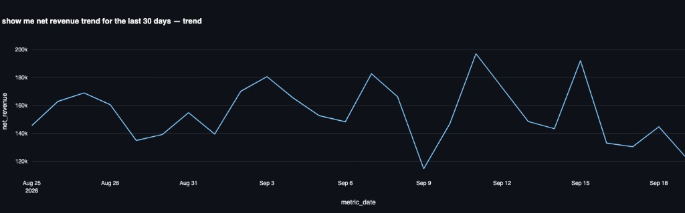
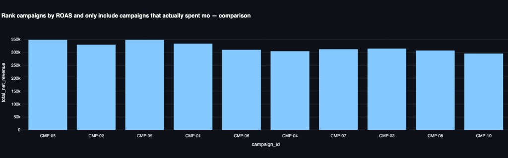
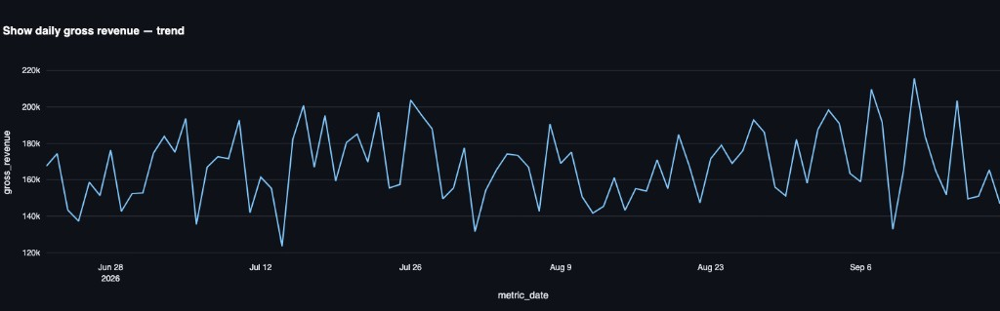

# Sample engine queries

The engine ran against local Gold (`ANALYTICS_DB_TARGET=local`). Each question was typed in the UI. The UI drew a chart and listed the rows in a table. The SQL below is the statement under "Show SQL and provenance" that produced both. Bronze and Silver were not queried.

## 1. Show me net revenue trend for the last 30 days

```sql
SELECT metric_date, net_revenue
FROM gold.executive_kpis_daily
WHERE metric_date >= CURRENT_DATE - INTERVAL '30' DAY
ORDER BY metric_date
```

Tables: `gold.executive_kpis_daily`. The UI showed this chart and a table of the same rows.



## 2. Rank campaigns by ROAS and only include campaigns that actually spent money

```sql
SELECT campaign_id,
       SUM(net_revenue) AS total_net_revenue,
       SUM(campaign_spend) AS total_campaign_spend,
       SUM(net_revenue) / NULLIF(SUM(campaign_spend), 0) AS roas
FROM gold.channel_campaign_daily
WHERE campaign_spend > 0
GROUP BY campaign_id
ORDER BY roas DESC
```

Tables: `gold.channel_campaign_daily`. The UI showed this chart and a table of the same rows. Spend is summed once per campaign, and a campaign with no spend is excluded.



## 3. Show daily gross revenue

```sql
SELECT metric_date, gross_revenue
FROM gold.executive_kpis_daily
ORDER BY metric_date
```

Tables: `gold.executive_kpis_daily`. The UI showed this chart and a table of the same rows.


